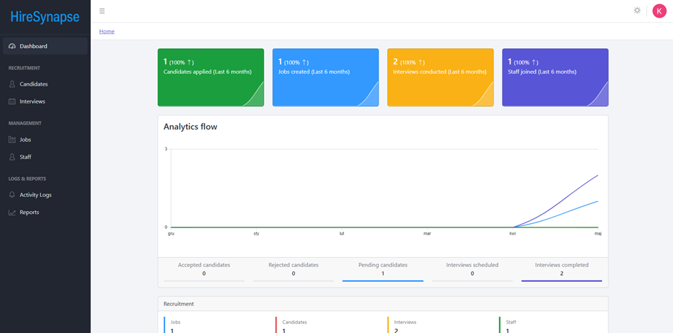
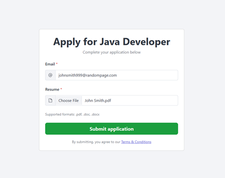
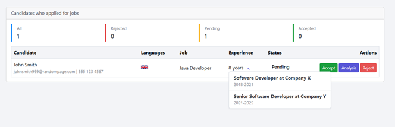
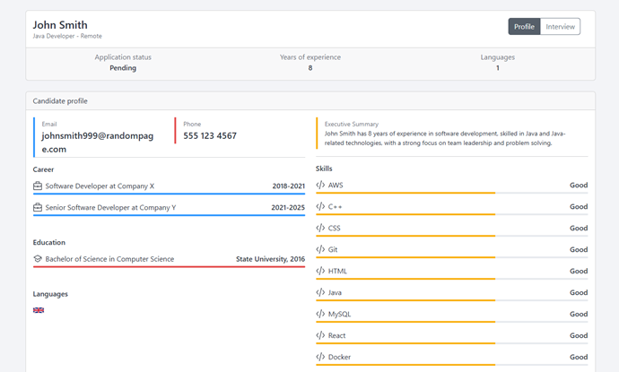
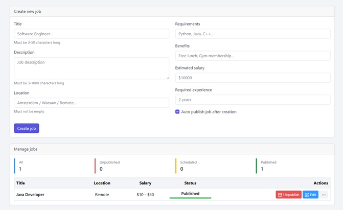
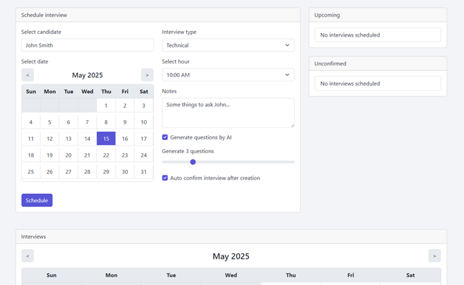
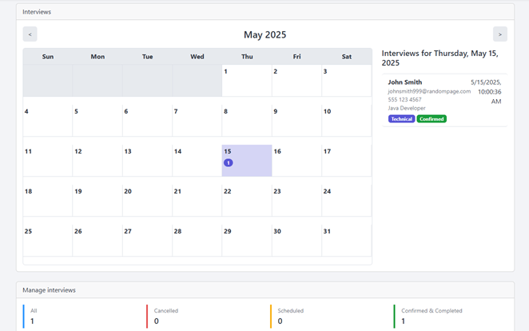

# HireSynapse

## Overview
**HireSynapse** is a helpful tool that makes hiring easier for companies and job seekers. 
This system uses AI to look at resumes automatically and show the most important information when you click on a candidate.
## Features

### Analytics
- Tracks different kinds of statistics
- Shows graph which shows data like accepted/rejected candidates and scheduled/completed interviews from last 6 months 

### Recruitment
- AI with a help of PDFBox and POI reads resumes and finds important information
- Shows short summaries about each person
- Allows for unlogged users to apply for jobs on main page
- Saves some time for recruiters because all resumes are displayed in a unified way
- Keeps all job applicants in one place
- Easy to click and see information about each person
- Helps you keep track of who applied
- Helps schedule and manage interviews
- Place to write notes about interviews
- Option to generate interview questions based off of interview type and job title
- Makes planning meetings with candidates easier

### Management
- Create and control job listings
- See how many people applied for each job
- Set what skills you need for each job
- Manage staff

### Logs & Reports
- Keeps records of all activities
- Generate and export reports

## Preview
### Job application


### Candidate list


### Candidate analysis


### Job management


### Interview schedule


### Interview calendar


## Installation

**1.** Pull images from Docker Hub
```bash
docker pull zrdzn/hiresynapse-backend:latest
docker pull zrdzn/hiresynapse-frontend:latest
```
**2.** Setup OpenAI API key on [OpenAI](https://platform.openai.com/)

**3.** Setup account on [Auth0](https://auth0.com/) and create a new application

**4.** Configure `.env` file

**5.** Run images

## Building from source
To build the backend from source, you can follow these simple steps:

**1.** Clone the repository:
```bash
git clone https://github.com/zrdzn/hiresynapse.git
cd hiresynapse/hiresynapse-backend
```
**2.** Build the backend using Gradle:
```bash
./gradlew bootJar
```
## License
- This project is licensed under the MIT License - see the [LICENSE](LICENSE)